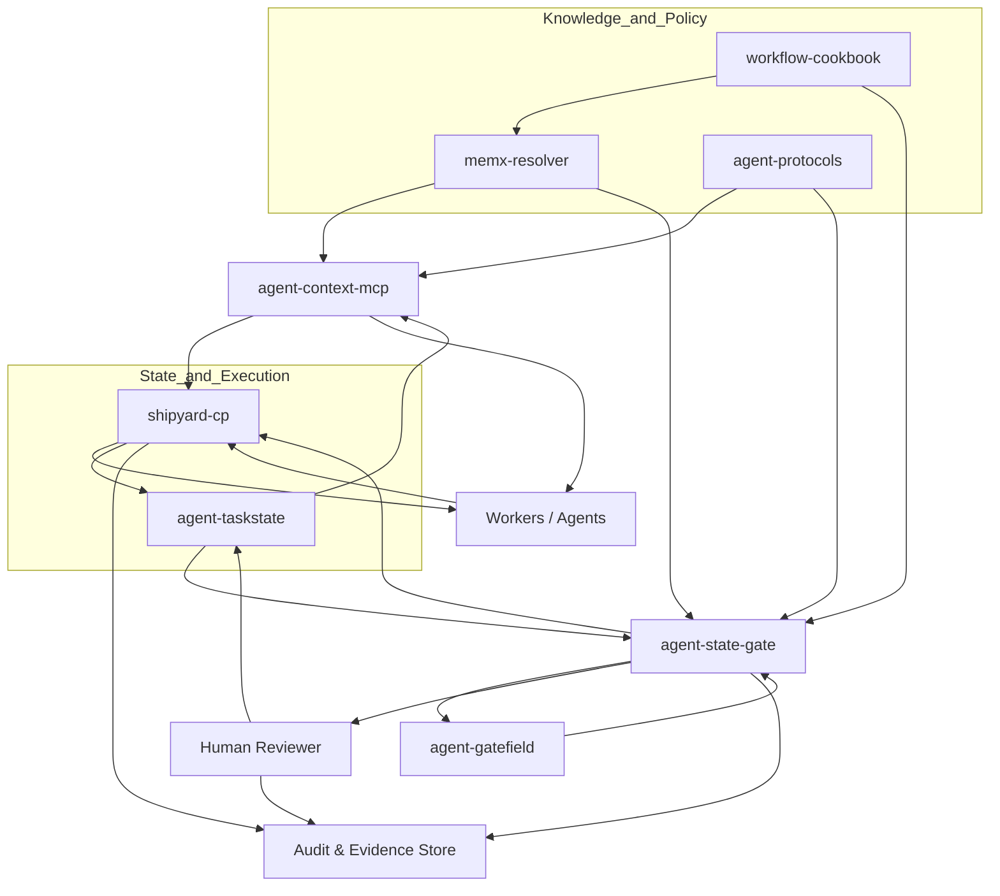
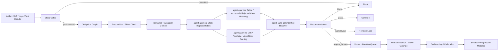

# Context Graph拡張とState-space Gateを統合したハーネス全部盛り要件定義書

## エグゼクティブサマリ

本報告書の結論は明確です。既存の Context Graph／Temporal Knowledge Graph は、**事実・関係・時間・出典・文脈組み立て**という「記憶レイヤー」としては十分に進化していますが、**義務、権限、証跡、承認、工程遷移、差分、スコープ逸脱、禁忌接近、人間注意の配線**といった「実行統治レイヤー」には届いていません。Graphiti は時間認識型グラフとハイブリッド検索、時間的無効化を前面に出し、entity["company","OpenAI","ai company"] の cookbook も時系列更新・検証・multi-hop retrieval を重視しています。Context Graph 系の周辺議論でも stable identity、typed edge、precedent / hybrid reranking は重要な論点ですが、本要件ではこれらを外部ベンダー固有機能ではなく memory substrate 側の一般要件として扱います。いずれにせよ中心は「記憶の更新と検索」であり、工程統治そのものではありません。citeturn16view0turn16view1turn16view5turn17view2

一方で、既存資産はすでに実行統治の大半を持っています。`workflow-cookbook` は Birdseye/Codemap、Task Seed、Acceptance、CI/Governance、Evidence tracking を束ね、`memx-resolver` は docs resolve・chunk供給・read ack・stale check・contract resolve を提供し、`agent-taskstate` は Task/State/Decision/Question/Run/ContextBundle を会話履歴から独立した正本にし、`agent-protocols` は IntentContract→TaskSeed→Acceptance→PublishGate→Evidence の契約駆動フローと承認ルールを定義し、`shipyard-cp` は plan→dev→acceptance→integrate→publish の状態機械と capability gate・lease・heartbeat・publish 制御を持っています。citeturn12view0turn12view1turn7view0turn7view1turn11view0turn11view1turn4view3turn8view0turn11view2turn11view3

したがって必要なのは、全面的な作り直しではありません。必要なのは、既存資産を横断する **二つの追加レイヤー**です。第一に `agent-context-mcp`。これは read-heavy な MCP façade として、context.recall / gate.evaluate / context.ack / stale_check / explain などを外部エージェントに標準化して見せる層です。第二に `agent-state-gate`。これは新規の判定アルゴリズム本体ではなく、`agent-gatefield` を State-space Gate 判定エンジンとして組み込み、義務グラフ、precondition/effect、semantic transaction、stale/approval/evidence、human attention、shipyard-cp の実行制御を束ねる **統合工程統治層**です。`agent-gatefield` は静的ゲート、状態ベクトル、DecisionEngine、taboo/case matching、drift/anomaly/uncertainty scoring、review queue、calibration、replay、audit を担い、`agent-state-gate` はそれらの結果を契約・状態・証跡・承認へ接続します。添付の「工程ゲートの状態空間化」草案は、まさにこの方向を先回りしており、静的ゲートと状態空間ゲートの分離、人間レビューの例外化、判断ログのゲート調律への還元を要点として置いています。citeturn19view0turn18view2turn18view3turn18view4turn18view1turn18view0 

ここでの `agent-context-mcp` は、P0 では独立 repo を要求しない論理接続面です。P0 では `agent-state-gate` 内の MCP surface として同居実装し、独立 repo / package 化は P1 以降の選択肢にします。

本報告書は、上記を踏まえて「全部盛り」要件を次のように定義します。**記憶は Context Graph、契約は agent-protocols、状態は agent-taskstate、実行は shipyard-cp、文書解決は memx-resolver、運用知は workflow-cookbook、状態空間判定は agent-gatefield、工程統治統合は agent-state-gate、外部接続は agent-context-mcp** です。`agent-taskstate` は Assessment の linked ref と task/run/context bundle の参照先のみを持ち、Assessment 本体の正本にはしません。未指定として残すべき項目は、Temporal Decision Graph backend の最終選定、認証基盤の製品選定、tenant 境界、保持期間、UI の深さ、モデル／ワーカー registry の詳細 schema です。これらは advisory / shadow / staging enforce までは差し込み可能な adapter / policy / schema の問題として扱えますが、Production Block Enforce に入る前には tenant 境界、認証・認可方式、retention policy を固定します。citeturn15search6turn15search1turn15search11

### 本版での名称と責務境界

上記の「薄い追加レイヤー」は、実装コストが小さいという意味ではなく、既存 OSS の正本責務を奪わないという意味です。全部盛り構成として、adapter、audit、review、replay、policy、dashboard、benchmark には十分なコストをかける前提にします。

本版では、`agent-state-gate` と `agent-gatefield` を次のように分離して扱います。`agent-state-gate` は工程統治の統合層であり、MCP façade、契約、状態、文書 stale、Evidence、Approval、Human Attention Queue、shipyard-cp の実行制御を束ねます。`agent-gatefield` は State-space Gate の判定エンジンであり、静的ゲート取り込み、状態ベクトル、DecisionEngine、taboo / accepted / rejected / judgment log matching、drift / anomaly / uncertainty scoring、review queue、calibration、replay、audit を担います。

したがって `agent-state-gate` は `agent-gatefield` を置き換えません。`agent-state-gate` は `agent-gatefield` の DecisionPacket を受け取り、agent-protocols の契約、agent-taskstate の task/run/context bundle、memx-resolver の docs resolve / stale、workflow-cookbook の Evidence / Acceptance、shipyard-cp の stage / publish control と合成して、外部向けの Assessment と gate verdict を返します。

## プロダクト要件

### Product one-liner

本プロダクトは、複数のエージェント、リポジトリ、文書、承認、実行制御をまたぐ開発工程に対し、**「いま進めてよいか」「何が不足しているか」「誰が見るべきか」「後から再現できるか」**を、MCP と既存 OSS 群の上で一貫して返す Agentic Work Governance Layer です。

### 対象ユーザーとジョブ

| ユーザー | 主なジョブ | 成功状態 |
|---|---|---|
| Agent platform owner | 複数エージェントの作業を安全に接続する | 外部 agent が同じ gate / context / evidence 契約で動く |
| Repository owner | repo 固有の guardrail と acceptance を運用する | publish 前に stale / approval / evidence 不足が止まる |
| Security reviewer | 高リスク差分だけを効率よく見る | taboo / taint / capability 逸脱が queue に集約される |
| QA / Acceptance owner | 仕様、受入条件、証跡を追跡する | acceptance と Evidence が Assessment に束縛される |
| Release manager | Go / No-Go を説明可能に判断する | audit packet と replay により判断根拠を提示できる |
| External agent / tool builder | MCP 経由で文脈と gate を利用する | read-heavy surface で安全に統合できる |

### プロダクト原則

- 正本を奪わない。既存 OSS の source of truth を移さず、`agent-state-gate` は統合 Assessment と制御判断を持つ。
- 判定根拠を隠さない。すべての verdict は causal trace、source refs、policy version、DecisionPacket ref を返す。
- 人間を最後の全文レビュアーにしない。人間には taboo、stale、conflict、approval、override、high-risk の例外だけを渡す。
- fail-open と fail-closed を暗黙化しない。adapter ごとに degraded warn、needs approval、deny、hold を明示する。
- まず shadow で測り、次に warn / hold を有効化する。強制ブロックは replay と calibration の証跡を条件にする。

### ユーザー可視の主要機能

| 機能 | 説明 | P0での期待 |
|---|---|---|
| Context Recall | task / action / stage から必要文書、chunk、契約、state を返す | 必須文書と stale 状態が返る |
| Gate Evaluate | diff / artifact / run を評価し、外部 verdict を返す | allow / revise / needs_approval / require_human / stale_blocked / deny を返す |
| Assessment View | DecisionPacket、stale、approval、evidence、obligation を統合表示する | CLI / JSON で追跡可能 |
| Human Attention Queue | 人間が見るべき例外を集約する | reviewer role と SLA が付く |
| Evidence Binding | 証跡を diff / context / approval に束縛する | audit packet v0 に含まれる |
| Replay / Explain | 過去 run の gate 判断を再現し説明する | P0 は最小 replay、P1 で差分説明 |
| Publish Control Hook | shipyard-cp の stage / publish と接続する | high-risk publish を hold できる |

### 提供形態と運用モード

| モード | 目的 | 強制度 |
|---|---|---|
| Local dev | 開発者が手元で context / gate を確認する | advisory |
| CI shadow | 既存 CI を止めずに gate 結果を収集する | non-blocking |
| Staging enforce | warn / hold / review queue を実運用に近い形で検証する | selective blocking |
| Production shadow | 本番 publish 経路で誤検知率と漏れを測る | non-blocking with audit |
| Production enforce | publish / high-risk action を実際に制御する | blocking |
| Audit / Replay | 事故調査、承認監査、回帰検証に使う | read-only |

### プロダクト品質要件

| 領域 | 要件 |
|---|---|
| 信頼性 | gate verdict は deterministic input に対して再現可能であり、非決定要素は audit packet に記録する |
| 説明可能性 | final verdict は最低でも hard blocker、soft signals、missing evidence、required human action を分離して返す |
| 互換性 | DecisionPacket / Assessment / Evidence / Adapter contract は schema_version を持ち、後方互換期間を定義する |
| セキュリティ | secret は保存せず、taint / redaction / declassification を evidence chain から追跡できる |
| 運用性 | adapter timeout、failure_policy、degraded 状態、queue backlog、override rate を観測できる |
| 拡張性 | backend、policy engine、review UI、model / worker registry は adapter として差し替え可能にする |

### 配布単位と成果物

プロダクトとしての提供単位は、単一サービスではなく、既存 OSS を束ねる導入可能な kit として定義します。

| 成果物 | 内容 | P0 |
|---|---|---|
| MCP server package | `agent-context-mcp serve` と read-heavy tool surface。P0 では `agent-state-gate` 内の `src/api/mcp_surface.py` として同居実装し、独立 repo / package 化は P1 以降の選択肢にする | 必須 |
| Integration service | DecisionPacket ingestion、Assessment assembly、verdict transformation | 必須 |
| Adapter SDK | 既存 OSS adapter の interface、failure_policy、contract test | 必須 |
| Policy bundle | gate policy、verdict mapping、risk profile、reviewer routing | 必須 |
| Schema bundle | Assessment、adapter response、audit packet、queue item の schema | 必須 |
| CLI | recall / evaluate / stale_check / replay / explain の最小操作 | 必須 |
| Example workspace | 最小デモ repo、fixture、golden verdict、audit packet sample | 必須 |
| Reviewer surface | attention.list と reviewer action の最小 UI または CLI | P0 は CLI 可 |
| Runbook | 導入、shadow、有効化、rollback、incident triage | P0 は最小 |

### 設定境界

導入ごとの差分はコード分岐ではなく、設定 bundle と adapter profile で吸収します。少なくとも次の設定ファイルを想定します。

| 設定 | 役割 |
|---|---|
| `asg.policy.yaml` | hard / soft rule、verdict priority、waiver 条件 |
| `asg.adapters.yaml` | adapter endpoint、timeout、failure_policy、operation_mode |
| `asg.reviewers.yaml` | reviewer role、SLA、escalation、approval authority |
| `asg.risk-profile.yaml` | path / capability / action / environment ごとの risk level |
| `asg.schema-lock.json` | Assessment / DecisionPacket / Evidence / adapter schema version lock |
| `asg.release-profile.yaml` | local / shadow / staging / production enforce の有効化範囲 |

設定変更はすべて audit 対象です。Production enforce では、policy / reviewer / risk profile の変更を shadow replay なしに即時反映してはいけません。

## 目的と背景

### Context Graphの現状と不足点

現在の Context Graph 系実装は、要約すると次の三つに収束しています。第一に、**時間を持つ事実と関係**を保存すること。Graphiti は「何が真か」だけでなく「いつ真だったか」を扱う temporally-aware context graph を掲げています。第二に、**context assembly** を行うこと。Context Graph 系の設計では、source / canonical / projection のような層分け、stable identity、typed edge、scoped context が重要論点になります。第三に、**更新と無効化**を扱うことです。Graphiti は temporal logic による古い事実の invalidation を強調し、entity["company","Zep","agent memory vendor"] の論文も、静的文書検索では足りず、会話や業務データの動的統合が必要だと述べています。citeturn16view0turn16view1turn17view2turn17view3

しかし、実務のエージェント工程で真に欠けやすいのは、単なる記憶ではありません。必要なのは、**この作業を進めてよいか、どの証跡が必要か、どの承認が現在の diff に束縛されているか、異常やドリフトを誰に見せるか、いつ publish を hold するか**を扱う工程統治です。Context Graph が decision flows や event traces を扱う方向へ広がるとしても、公開情報で安定して確認できる中心は semantic memory layer と retrieval / reranking です。そこから一歩進めて、**義務・権限・証跡・承認・差分・スコープ・例外・人間注意**まで一貫して扱う必要があります。

### 既存資産が埋めている領域

既存資産は、実はこの不足のかなり大きな部分をすでに埋めています。`workflow-cookbook` は docs/runtime kit として Birdseye/Codemap、Task Seeds、Acceptance、CI / Governance、Evidence tracking、cross-repo integration と docs resolve を持ちます。`memx-resolver` は docs:resolve / chunks:get / reads:ack / docs:stale-check / contracts:resolve を提供し、read receipt と stale 判定を taskstate に委譲できる設計です。`agent-taskstate` は task state を chat history から切り離した source of truth とし、task / task_state / decision / open_question / context_bundle / run / task_link の schema を持ちます。`agent-protocols` は 5 種の契約と approval rules を定義し、`shipyard-cp` は explicit state machine と dispatch/result/integrate/publish API を持ちます。**つまり、memory・contract・state・orchestration はすでにある**のです。citeturn12view0turn12view1turn7view0turn7view1turn11view0turn11view1turn4view3turn8view0turn11view2turn11view3

### 本報告書の立場

本報告書は、Context Graph を否定しません。むしろ、**Context Graph を memory substrate として前提化したうえで、その上に Temporal Decision Graph と State-space Gate を載せる**立場です。Temporal Decision Graph は policy / decision / obligation / evidence / approval / waiver / case を、validity・authority・confidence・taint 付きで持つ論理グラフです。State-space Gate は、それらを参照して現在の artifact / diff / run / pipeline stage を評価し、pass / warn / revise / require_human / block を返す runtime control layer です。添付草案が目指す「人間は全文ではなく、ドリフト・禁忌接近・異常遷移・判断衝突だけを見る」という運用を、既存資産の上で実装可能な形に落とし込みます。fileciteturn0file0

### 現状比較の要約

以降では、`pass / warn / hold / block` を `agent-gatefield` 内部 decision、`allow / revise / needs_approval / require_human / stale_blocked / deny` を外部 `gate.evaluate` verdict として扱い、両者を混同しません。

| 観点 | Context Graph標準 | 既存資産 | 本設計で追加するもの |
|---|---|---|---|
| 記憶 | Facts / relations / time / retrieval | memx-resolver + agent-taskstate | Temporal Decision Graph へ拡張 |
| 文書解決 | ある | ある | task/action/capability 起点の recall 強化 |
| stale / invalidate | ある | 文書 stale はある | workflow-aware invalidation cascade |
| 契約 | 弱い | agent-protocols がある | obligation/precondition/effect へ拡張 |
| 実行制御 | 弱い | shipyard-cp がある | State-space Gate で補強 |
| 人間注意ルーティング | 弱い | 部分的 | Human Attention Queue を中核化 |
| 証跡と監査 | ベンダーごとに差 | Evidence / audit がある | attestation / audit packet / chain-of-custody を統合 |

## スコープと用語

### スコープ

本要件が**含む**ものは、既存六資産と二つの追加層を横断した、工程統治の統合仕様です。具体的には、Context/Decision ontology、時間モデル、MCP façade、State-space Gate、Human Attention Queue、policy-as-code、evidence chain、approval binding、security/taint controls、benchmark harness、adapter 契約、最小デモまでを含みます。`workflow-cookbook` の Birdseye/Codemap・Acceptance・Evidence、`memx-resolver` の docs resolve / ack / stale / contract、`agent-taskstate` の canonical state、`agent-protocols` の契約と approval、`shipyard-cp` の orchestration を、**一つの logical control plane** として再定義します。citeturn12view0turn12view1turn7view0turn11view0turn4view3turn8view0

本要件が**除外**するものは、完全自律 publish、法務・医療・金融など高リスク領域の最終判断、無制限の MCP write surface、任意コマンド実行、secret の保存・再配布、policy mutation の完全自動化、単一 embedding score のみを根拠にした承認、巨大な新規 graph DB 製品のゼロから構築、Windows ネイティブ pgvector ビルドを標準導入経路または本番稼働要件にすることです。MCP は公開インタフェースに留め、実行権限の中心は既存 control plane と policy に残します。citeturn18view2turn19view0turn18view1turn18view0

### 未指定事項

以下は **未指定** として明示的に残します。これらは設計を止める理由ではなく、adapter / policy / deployment 課題として後段で選定します。なお、ここで未指定とする graph backend は Temporal Decision Graph の保存先であり、`agent-gatefield` の Judgment KB / state vector / gate decision store とは別レイヤーです。`agent-gatefield` 側は PostgreSQL/pgvector を既定の vector store として扱い、Production Shadow / Production Enforce では実 DB 上の pgvector、schema migration、health check、backup、retention を稼働条件にします。P0 の local / CI / contract acceptance は Dockerized pgvector を標準経路、mock / in-memory fallback を契約検収経路にできますが、mock / in-memory は本番代替ではありません。Windows ネイティブ pgvector ビルドは開発者端末向けの任意経路であり、プロダクトの本番要求には含めません。

- Temporal Decision Graph backend の最終選定。候補は entity["company","Neo4j","graph database vendor"]、entity["organization","Kuzu","graph database project"]、entity["company","FalkorDB","graph database vendor"] など。citeturn15search6turn15search1turn15search11
- multitenancy と retention policy の詳細。
- 認証・認可基盤の製品選定。
- UI の完成度と reviewer console の範囲。
- Model / Worker capability registry の最終 schema。
- publish target catalog と environment taxonomy。
- domain-specific taboo / accepted case / rejected case の初期 corpus。

### 用語定義

#### ノード ontology

| 用語 | 定義 | 最低限の属性 |
|---|---|---|
| Fact | 世界や業務の事実 | subject, predicate, object, observed_at, valid_from, valid_until, confidence |
| Policy | 守るべき規則 | policy_id, rule, scope, severity, authority_level, lifecycle_state |
| Decision | 過去の採否・理由 | decision_id, summary, rationale, status, decided_by, created_at, half_life |
| Obligation | 満たすべき義務 | obligation_id, required_before, required_after, severity, satisfaction_state |
| Evidence | 証跡 | evidence_id, evidence_type, producer, strength, artifact_refs, chain_state |
| Taboo | 禁忌 | taboo_id, description, action_on_match, severity, scope |
| Case | 採用例 / 却下例 | case_id, case_type, authority, weight, tags, status |
| Capability | 実行権限 | capability_id, scope, lease, max_risk_level |
| Action | 実行単位 | action_id, verb, target, preconditions, effects |
| Task | 継続作業単位 | task_id, objective, scope, owner, current_state |
| Run | 単回の実行 | run_id, actor, stage, status, started_at, finished_at |
| ContextBundle | 実行時に束ねた文脈 | bundle_id, purpose, summary, sources, state_snapshot |
| Approval | 承認 | approval_id, approver_role, bound_diff, bound_context_hash, expires_at |
| Waiver | 一時例外 | waiver_id, scope, reason, expires_at, follow_up_required |
| Assessment | 統合 gate 評価結果。`agent-gatefield` の DecisionPacket を中核に、obligation / stale / evidence / approval / context attestation を束ねる | assessment_id, decision_packet_ref, scores, recommendation, threshold_version, context_hash |

#### エッジ ontology

| 関係 | 意味 |
|---|---|
| SUPPORTS | A が B の根拠になる |
| CONTRADICTS | A が B と矛盾する |
| SUPERSEDES | A が B を置き換える |
| INVALIDATES | A が B を失効させる |
| GATES | A が B の実行可否を制御する |
| REQUIRES | A が B を必要とする |
| SATISFIED_BY | Obligation が Evidence/Action により満たされる |
| VIOLATED_BY | Policy / Taboo が Artifact / Action によって侵害される |
| DERIVED_FROM | 要約や evidence が元データから導出された |
| READ_BY | doc/chunk が task/run により読まれた |
| EXECUTED_BY | action/run が worker/human により行われた |
| APPROVED_BY | publish/task/waiver が approver により承認された |
| BOUND_TO | approval/evidence が diff / context / task に束縛される |
| TAINTED_FROM | 派生データが低信頼入力に由来する |
| PART_OF | chunk→doc、run→task などの包含関係 |

#### 主要概念の意味

- **Temporal Decision Graph**: Context Graph に、Decision / Policy / Obligation / Evidence / Approval / Waiver / Case を追加し、時間・authority・taint・confidence を持たせた論理グラフ。
- **State-space Gate**: artifact / diff / logs / context / decisions / taboos / cases / obligations を入力として、状態空間上で異常や逸脱を判定する制御層。
- **Human Attention Queue**: 人が全文レビューする代わりに、block / taboo / stale / conflict / high-risk / override 待ちだけを集約するキュー。
- **Assessment**: static gate と state-space gate の統合評価単位。
- **Capability Lease**: capability を task / scope / time に限定して貸し出す実行権限。

#### agent-gatefield とのデータ対応

`agent-gatefield` の `DecisionPacket` は State-space Gate 判定の正本であり、全部盛り要件の `Assessment` はそれを含む上位集約です。二重実装を避けるため、`agent-state-gate` は taboo / drift / anomaly / uncertainty の再計算を原則として行わず、`agent-gatefield` の decision、factors、exemplar refs、threshold_version、state_vector_ref、audit refs を読み取って統合判断へ変換します。

| 全部盛り概念 | agent-gatefield 概念 | 役割 |
|---|---|---|
| Assessment | DecisionPacket + integration supplements | 外部に返す統合評価単位 |
| scores | scorer outputs / factors | gatefield が算出した判定根拠 |
| recommendation | decision + action | pass/warn/hold/block を統合 verdict へ変換 |
| context_hash | state_vector_ref + context bundle hash | 再現性と approval freshness の基準 |
| evidence refs | static_gate_summary / audit event / Evidence records | publish / acceptance で参照する証跡 |
| human queue item | human_reviews / review queue item + task/run binding | reviewer routing と SLA 管理 |

`Assessment` は少なくとも `decision_packet_ref`, `task_id`, `run_id`, `stage`, `context_bundle_ref`, `stale_summary`, `obligation_summary`, `approval_summary`, `evidence_summary`, `final_verdict`, `causal_trace`, `counterfactuals`, `audit_packet_ref` を持ちます。

## アーキテクチャ概観

### 既存リポジトリの役割

既存資産の役割分担はすでにかなり明瞭です。`workflow-cookbook` は「運用知・文書・Evidence・Acceptance・Governance」の原本ハブであり、Birdseye/Codemap と cross-repo integration を持ちます。`memx-resolver` は feature / task / topic から必要文書と必要 chunk を解決し、読了記録・stale・contract resolve を返す resolver です。`agent-taskstate` は chat history ではなく task/state/decision/context bundle を正本化する state store です。`agent-protocols` は Intent / Task / Acceptance / Publish / Evidence の contract system です。`shipyard-cp` は explicit state machine を持つ upstream control plane であり、worker dispatch、heartbeat、integrate、publish を受け持ちます。citeturn12view0turn12view1turn7view0turn7view1turn11view0turn11view1turn4view3turn8view0turn11view2turn11view3

本報告書では、ここに二つの追加層を置きます。`agent-context-mcp` は外部エージェントとの標準接続面であり、MCP の Resources / Prompts / Tools モデルに従って context と gate を公開します。`agent-state-gate` は、添付草案を起点に static gate + state-space gate + human queue を実装する新しい工程統治層です。citeturn19view0turn18view2turn18view3turn18view4 fileciteturn0file0

P0 の実装単位としては、`agent-context-mcp` を独立 repo として必須化しません。まず `agent-state-gate` の `src/api/mcp_surface.py` 相当の API surface として提供し、外部コマンド名や package 分離は P1 以降に固定します。

`agent-state-gate` の内部では、状態空間判定を `agent-gatefield` に委譲します。`agent-gatefield` は HarnessAdapter / StateEncoder / DecisionEngine / ReviewQueue / Replay / Audit を持つ判定エンジンであり、`agent-state-gate` はその DecisionPacket に stale、obligation、approval、evidence、publish readiness を重ねて統合 Assessment を作ります。

### 推奨構成図



この構成のポイントは、**判定エンジンと統合統治を分ける**ことです。`agent-context-mcp` は façade、`agent-gatefield` は State-space Gate evaluator、`agent-state-gate` は統合 orchestrator です。正本は依然として既存資産に残し、`agent-state-gate` はそれらを読むだけでなく、**workflow-aware invalidation** と **human-routing** を担います。`agent-state-gate` は gatefield の score を再実装せず、契約、状態、stale、approval、Evidence、publish stage を合成して最終 verdict を決定します。citeturn8view0turn11view3turn7view0turn11view0

### 推奨責務分解

| レイヤー | 主責務 | 正本 |
|---|---|---|
| workflow-cookbook | Birdseye/Codemap、Acceptance、Evidence、Governance、docs 原本 | Markdown / CI artifacts |
| memx-resolver | docs resolve、chunks、ack、stale、contract resolve | resolver store + taskstate連携 |
| agent-taskstate | task/state/decision/question/context bundle/run | SQLite / taskstate schema |
| agent-protocols | contract types、approval rules、publish gate semantics | schema / validation |
| shipyard-cp | orchestration、dispatch、heartbeat、integrate、publish | control plane events |
| agent-context-mcp | read-heavy MCP surface | façade only |
| agent-gatefield | static gate ingest、state vector、DecisionEngine、scorers、review queue、calibration、replay、audit | DecisionPacket / state_vectors / gate_decisions / human_reviews |
| agent-state-gate | obligation / stale / approval / evidence / gatefield decision を合成する工程統治統合層 | Assessment / audit packet refs / integration state |

### 正本境界

統合時の二重書き込みを避けるため、生成者、保存先、参照者を次のように固定します。

| オブジェクト | 生成者 | 正本保存先 | 主な参照者 |
|---|---|---|---|
| Task / Run / ContextBundle | agent-taskstate / shipyard-cp | agent-taskstate | memx-resolver, agent-state-gate, agent-context-mcp |
| DecisionPacket | agent-gatefield | agent-gatefield gate_decisions / audit | agent-state-gate, agent-context-mcp |
| Assessment | agent-state-gate | agent-state-gate assessment store。agent-taskstate には `assessment_id` / `audit_packet_ref` の linked record のみ保存する | agent-context-mcp, shipyard-cp |
| Evidence | workflow-cookbook / agent-protocols adapter | Evidence store / workflow-cookbook artifacts | agent-state-gate, shipyard-cp |
| Approval / Waiver | agent-protocols adapter + human workflow | agent-protocols compatible store / agent-taskstate decision | agent-state-gate, shipyard-cp |
| Human Queue Item | agent-state-gate + agent-gatefield review queue | agent-gatefield human_reviews + task/run binding | reviewer console, shipyard-cp |
| Publish Hold / Resume | shipyard-cp | shipyard-cp control plane events | agent-state-gate, reviewer |

## データモデルとAPI設計

### Context Graph標準と本設計の比較

Graphiti / Zep / OpenAI temporal KG などの公開資料から読み取れる標準的な Context Graph は、**fact / relation / time / provenance / retrieval / invalidation** に強い一方で、**obligation / evidence binding / approval freshness / scope lock / semantic transaction / human queue / regression harness** は設計外か、少なくとも中心機能ではありません。本設計はそこを意図的に拡張します。citeturn16view0turn16view1turn16view5turn17view2

| 観点 | Context Graph標準 | 本設計の拡張 |
|---|---|---|
| 正本単位 | Fact / Entity / Relation | Task / Run / Decision / Policy / Obligation / Evidence / Assessment |
| なぜの保持 | provenance, reasoning note | Decision / rationale / causal trace / counterfactual |
| 時間 | valid_from / valid_to / historical facts | + observed_at / approval freshness / decision half-life / confidence decay |
| 無効化 | facts / relationships | + task acceptance / publish gate / evidence / approval への cascade |
| 実行 | query-oriented | action/capability/gate-oriented |
| 証跡 | source provenance | evidence chain-of-custody / attestation / audit packet |
| セキュリティ | source provenance が中心 | taint / authority / declassify / tool intent verification / capability lease |
| 人間介入 | optional | human attention queue, reviewer routing, SLA, override/waiver lifecycle |
| 再現性 | historical query | context snapshot hash / prompt hash / tool schema version / replay |
| 進化 | graph update | policy shadow mode / regression test / learning loop governance |

### 推奨属性と時間モデル

本設計では、すべての主要ノードが少なくとも次の一部を持つことを推奨します。

| 属性 | 用途 |
|---|---|
| valid_from / valid_until | 事実・policy・approval の有効期間 |
| observed_at | 真偽を観測した時刻 |
| ingested_at | システム取り込み時刻 |
| confidence | 事実・summarization・classification の信頼度 |
| authority_level | human policy > repo policy > task contract > agent summary などの階層 |
| taint | trusted / internal / external_untrusted / derived_untrusted |
| half_life | decision / assumption / exception の自然劣化 |
| superseded_by / revoked_by | invalidation chain |
| bound_diff_hash | approval/evidence の対象 diff 束縛 |
| bound_context_hash | approval/evidence の対象 context 束縛 |
| lease_expires_at | capability lease の期限 |
| retention_class | 保存期間・削除要件 |

Temporal Decision Graph の候補 backend は、規模と運用形態に応じて選べばよく、現時点で固定する必要はありません。中央集権・可視化重視なら entity["company","Neo4j","graph database vendor"]、embedded・ローカル処理重視なら entity["organization","Kuzu","graph database project"]、低遅延 GraphRAG 系なら entity["company","FalkorDB","graph database vendor"] が現実的な候補です。一方、`agent-gatefield` の Judgment KB / state vectors / gate_decisions は PostgreSQL/pgvector を前提にしてよく、ここを Temporal Decision Graph backend と無理に統合しません。P0 local / CI では Windows ネイティブ pgvector ビルドを成功条件にせず、Docker Compose などの pgvector 同梱 Postgres または mock / in-memory vector store で state vector coverage、DecisionPacket ingestion、verdict mapping、replay を検収します。ただし、Production Shadow / Production Enforce の entry criteria は実 PostgreSQL/pgvector backend の正常性を必須とします。両者は `decision_packet_ref`, `state_vector_ref`, `assessment_id`, `evidence_id`, `task_id`, `run_id` で参照接続します。citeturn15search6turn15search1turn15search11

Windows ネイティブ pgvector は、Visual Studio C++ support、x64 Native Tools Command Prompt、`PGROOT`、`nmake`、PostgreSQL extension ファイル配置が絡むため、標準サポートパスから外します。プロダクトのアウトカムは「各開発者端末で拡張をビルドできること」ではなく、「標準ランタイムで同一 fixture から同一 Assessment / verdict / audit packet を再現でき、Production Enforce では実 DB / index / backup / health check を満たすこと」です。

#### pgvector ランタイム方針

| 環境 | 必須 runtime | 受入アウトカム | mock / in-memory の扱い |
|---|---|---|---|
| Local dev | Dockerized pgvector 推奨、mock / in-memory 可 | 開発者が Windows native build なしで evaluate / replay を確認できる | 契約検証と UI / adapter 開発に限定 |
| CI | Dockerized pgvector または test container | schema migration、vector search、DecisionPacket ingestion、golden verdict が通る | DB 非依存の contract test に限定 |
| Staging enforce | 実 PostgreSQL/pgvector backend | production 相当の latency、health check、failure_policy、replay を検証する | 不可。障害注入時のみ使用 |
| Production shadow | 実 PostgreSQL/pgvector backend | 本番 mirror traffic で誤検知率、漏れ、queue backlog、audit completeness を測る | 不可 |
| Production enforce | HA / backup / retention 付き PostgreSQL/pgvector backend | high-risk action をブロックでき、復旧・監査・再現が可能 | 不可 |

本番で pgvector backend が利用不能な場合、`agent-gatefield` の KB unavailable 方針に従って semantic similarity 系 signal を degraded として記録します。ただし Production Enforce では「検出不能なまま allow」しません。hard rule、static gate、approval、stale、capability、policy violation で判断できない高リスク action は `require_human` または `deny` に倒し、audit packet に `kb_unavailable` と `unavailable_axes` を残します。

### MCP surface の方針

MCP の公式仕様では、server は Resources / Prompts / Tools を公開し、Tools は model-controlled である一方、明示的な user consent と human-in-the-loop が強く推奨されています。Resources は URI で識別される context 面、Prompts は user-controlled なテンプレート、Tools は schema を持つ呼び出し対象です。Remote server で protected resources を扱う場合は OAuth 系の authorization を想定し、STDIO transport では環境資格情報や埋め込みライブラリ資格情報を使う運用が説明されています。citeturn19view0turn18view2turn18view3turn18view4turn18view1turn19view1

本設計では、**read-heavy / write-light / dangerous mutation internal-only** を原則とします。MCP から出すのは、基本的に `recall`, `evaluate`, `simulate`, `explain`, `list`, `replay`, `assess` までです。`remember`, `relate`, `invalidate`, `policy mutate`, `publish apply` は内部 API か人間承認付き API に留めます。citeturn18view2turn19view0turn18view0

### API 一覧

以下の表は、**必須 API の提案契約**です。既存の repo 境界を壊さず、delegate 先を明示した形で定義します。

| API | 主入力 | 主出力 | 委譲先 | セキュリティ制約 |
|---|---|---|---|---|
| `context.recall` | task_id, feature, action, touched_paths, limit | required/recommended docs, chunk refs, contract refs, stale summary | memx-resolver, agent-taskstate, workflow-cookbook | read-only、secret redaction、taint付与 |
| `gate.evaluate` | task_id, action, capabilities, risk_hints, touched_paths | allow/revise/deny/needs_approval/require_human/stale_blocked, required_evidence, approvals | agent-state-gate, agent-gatefield, agent-protocols, shipyard-cp | destructive capability は lease 必須 |
| `context.ack` | task_id, doc_id, version, chunk_ids | ack_ref, updated read receipt | memx-resolver, agent-taskstate | append-only、task ownership check |
| `context.stale_check` | task_id | fresh/stale, stale reasons | memx-resolver, agent-taskstate | read-only |
| `evidence.record` | task_id, evidence_type, summary, artifact_refs | evidence_id, chain state | workflow-cookbook, agent-protocols, agent-taskstate | append-only、secret scan、PII redact |
| `context.explain` | target assessment / gate result | human-readable explanation, basis refs | agent-state-gate, agent-gatefield, agent-protocols | no raw secret replay |
| `gate.simulate` | hypothetical action, diff summary, target stage | blockers, missing evidence, counterfactuals | agent-state-gate, agent-gatefield, shipyard-cp | no side effects |
| `context.pack` | task_id, action, token_budget, priority | packed_context, included/excluded lists | memx-resolver, workflow-cookbook, agent-taskstate | minimality principle、taint/authority order |
| `context.detect_conflicts` | task_id or bundle_id | policy/decision/doc conflicts | agent-state-gate, memx-resolver, agent-protocols | read-only |
| `attention.list` | queue_scope, reviewer_role, status | pending attention items | agent-state-gate, agent-gatefield, shipyard-cp | reviewer authorization required |
| `run.replay_context` | run_id, as_of | historical context snapshot, decision diff | agent-taskstate, audit store, agent-state-gate, agent-gatefield | read-only、attested snapshot only |
| `state_gate.assess` | artifact refs, diff, run_id, stage | state-space assessment, recommended action | agent-state-gate, agent-gatefield | high-risk outputs require human queue emission |

### Verdict 変換規則

`agent-gatefield` の内部 decision は `pass / warn / hold / block` です。一方、MCP や外部 agent に返す `gate.evaluate` は工程統治上の verdict を返します。変換は `agent-state-gate` が担当し、stale、approval、obligation、evidence、capability、publish stage を合成して最終化します。

| agent-gatefield decision | 統合条件 | 外部 verdict | shipyard-cp への推奨動作 |
|---|---|---|---|
| pass | stale なし、obligation 充足、必要 approval 充足 | allow | continue / next stage |
| pass | required docs / acceptance / approval が stale | stale_blocked | hold current stage, request reread / reapproval |
| pass | 必須 approval が不足、または evidence 追加で解消可能な不足 | needs_approval | hold_for_review |
| pass | obligation 未充足で reviewer 判断が必要 | require_human | hold_for_review |
| pass | critical obligation 未充足、かつ waiver 不可 | deny | block / fail closed |
| warn | self-correction 可能、hard 条件なし | revise | self-correction loop |
| warn | 高権限 action / uncertainty 高 / reviewer 必須 | require_human | hold_for_review |
| hold | reviewer 判断が必要 | require_human | pause run and enqueue review |
| hold | SLA timeout または reviewer reject | deny | block / fail closed |
| block | static hard fail / taboo critical / secret / forbidden capability | deny | block and create correction action |
| 任意 | approval bound_diff_hash または bound_context_hash 不一致 | needs_approval | invalidate approval and hold |

`stale_blocked` は `agent-gatefield` の decision ではなく、memx-resolver / agent-taskstate / agent-protocols の freshness 判定から `agent-state-gate` が上書きする外部 verdict です。`needs_approval` と `require_human` は、前者を approval 欠落、後者を human judgment 欠落として使い分けます。

### Resources と Prompts

MCP resource は次の URI を推奨します。

- `context://task/{task_id}`
- `context://task/{task_id}/bundle`
- `context://task/{task_id}/stale`
- `context://task/{task_id}/evidence`
- `context://decision/{decision_id}`
- `context://policy/{policy_id}`
- `context://assessment/{assessment_id}`
- `context://attention-queue/{reviewer_role}`

Prompt は次を推奨します。

- `plan_with_context`
- `acceptance_review`
- `publish_gate_review`
- `state_gate_triage`
- `counterfactual_review`

## State-space Gateと判定ロジック

### State-space Gateの構成要素

添付草案の中核思想は、**静的ゲートで機械的問題を止め、状態空間ゲートで設計方針・禁忌・過去判断とのズレを検知し、人間は例外だけを見る**というものです。これを本設計では次のコンポーネントに分解します。fileciteturn0file0

| 要素 | 主担当 | 役割 | 典型入力 |
|---|---|---|---|
| Static Gates | agent-gatefield + CI adapters | テスト、lint、secret、license、SAST、forbidden path/cmd | diff, build artifacts, scan outputs |
| Obligation Graph | agent-state-gate + agent-protocols | 何を満たす必要があるかを管理 | task contract, publish policy, stage obligations |
| Precondition / Effect Model | agent-state-gate + shipyard-cp | action 前提条件と事後効果を検証 | action, stage, current state |
| Semantic Transaction | agent-state-gate + shipyard-cp | commit/abort/partial commit の意味境界 | diff, test results, rollback plan |
| State Representation | agent-gatefield | artifact / logs / decisions を複合状態へ変換 | summaries, refs, embeddings, scores |
| Taboo / Case Matching | agent-gatefield | taboo proximity, accepted/rejected similarity | artifact summary, case corpus |
| Drift / Anomaly Scoring | agent-gatefield | 目的・スコープ・リスク・判断の逸脱検知 | task seed, previous runs, current diff |
| Conflict Resolver | agent-state-gate | static, policy, stale, approval, taboo, drift の衝突解決 | DecisionPacket, stale, obligation, approval |
| Shadow Mode | agent-gatefield + agent-state-gate | 新 policy / threshold を本番前に裏評価 | historical runs, candidate policy |
| Regression Harness | agent-gatefield + agent-state-gate | gate 変更の影響を replay で測る | archived runs, assessments |

### 推奨評価フロー



### 判定順序

判定は次の順に行うことを推奨します。

1. task / run / stage / actor の存在確認  
2. task state と stage 遷移の妥当性確認  
3. required docs / contract / expected_version の解決  
4. read receipt と stale の確認  
5. static critical failures の評価  
6. capability lease と risk hints の確認  
7. obligation graph の未充足確認  
8. preconditions の確認  
9. taboo proximity / rejected-case similarity の確認  
10. constitution alignment / accepted-case support の確認  
11. drift / anomaly / consistency / uncertainty の算出  
12. conflict resolver による最終 recommendation 決定  
13. human queue / auto-pass / revision / block の分岐

この順序は、`shipyard-cp` の state machine と自然に接続できます。`accepting -> accepted` は stale docs が未解消なら拒否でき、`integrated -> publish_pending_approval` / `publishing` は approval と idempotency を要求できます。citeturn8view0turn11view3turn9view3

### Hard 条件と Soft 条件

| 種別 | 条件 | 既定アクション |
|---|---|---|
| Hard | secret 混入、forbidden command/path、critical SAST、forbidden capability | deny |
| Hard | stale required docs、approval stale、acceptance stale | stale_blocked |
| Hard | obligation 未充足、publish evidence 不足、non-goal 重大侵害 | require_human。critical obligation 未充足かつ waiver 不可なら deny |
| Hard | taboo critical、authority hierarchy 逆転、untrusted context による policy override | deny |
| Soft | recommended doc unread、evidence weak、flaky test 由来 | warn |
| Soft | drift 中程度、accepted-case support 低、uncertainty 高 | revise または require_human |
| Soft | anomaly 軽微、cost/latency budget 逼迫 | warn |

### 優先順位

最終判定の優先順位は次を推奨します。

`critical static fail`  
> `taboo / secret / compliance deny`  
> `approval or stale hard block`  
> `require_human`  
> `revise`  
> `warn`  
> `pass`

### Counterfactual と Causal Trace の出力例

```json
{
  "current_decision": "needs_approval",
  "counterfactuals": [
    {
      "if": "rollback_plan evidence exists",
      "then": "decision becomes allow"
    },
    {
      "if": "touched_paths excludes infra/**",
      "then": "risk_level becomes medium and manual approval is not required"
    }
  ]
}
```

```json
{
  "causal_trace": [
    "touched_paths includes infra/**",
    "policy P-INFRA-001 raises risk level to high",
    "high risk requires project_lead and security_reviewer approval",
    "security_reviewer approval is missing",
    "final decision = needs_approval"
  ]
}
```

これらは explanation より一段機械可読にし、audit packet に含めるべきです。

## 人間ワークフローとガバナンス

### Human Attention Queue

添付草案の最重要点は、「人間は全文レビューではなく、異常だけを見る」ことです。本設計では Human Attention Queue を first-class object にします。queue item は少なくとも `reason_code`, `severity`, `required_role`, `due_at`, `bound_task`, `bound_run`, `bound_assessment`, `suggested_actions` を持ちます。queue へ流れる条件は、taboo proximity、rejected-case similarity、高リスク capability、stale unresolved、conflict_detected、approval_missing、evidence_missing、anomaly_high、override_requested です。fileciteturn0file0

### Reviewer routing と SLA

| トリガー | 既定 reviewer | 初回SLA | Escalation |
|---|---|---|---|
| security / secret / prod_data | security reviewer | 4営業時 | project lead |
| publish apply / environment rule | release manager | 4営業時 | project lead |
| scope drift / taboo / architecture | project lead / architect | 8営業時 | owner fallback |
| weak evidence / flaky / acceptance stale | QA / acceptance owner | 8営業時 | project lead |
| policy conflict / waiver / override | policy owner | 8営業時 | governance board 相当 |

### Override policy と waiver lifecycle

Override は常態化させてはいけません。`override` は人間だけが発行でき、`reason`, `accepted_risk`, `scope`, `bound_diff_hash`, `expires_at`, `required_followup`, `followup_due_at` を必須にします。Waiver は再利用を禁止するか、明示的に reusable=false を既定にします。approval は current diff と current context hash に束縛し、diff 変更・risk 上昇・stale 発生があれば freshness を失います。`shipyard-cp` が publish に idempotency と pending approval を要求していることと整合します。citeturn11view3turn8view0

### Policy-as-Code と learning loop governance

Policy は YAML/JSON で定義し、少なくとも次の lifecycle を持つべきです。

`proposed -> shadow -> regression_validated -> approved -> active -> superseded/revoked -> archived`

これに加えて `policy.lint` を持ち、到達不能 rule、矛盾 rule、広すぎる許可、owner 不在、high-risk に evidence/approval がない rule を検出します。learning loop は、「事故や reviewer 判断から policy 候補を提案する」のは許す一方、「即 active にする」のは禁止します。必ず shadow mode と regression test を通し、人間承認を必要にします。これは MCP と同様に、強い操作には explicit consent と review が必要だという原則と整合します。citeturn18view2turn19view0turn18view0

### Evidence chain-of-custody と attestation

Evidence は単なるファイル参照では足りません。少なくとも `produced_by`, `source_artifacts`, `summarized_by`, `reviewed_by`, `locked_at`, `hash`, `redaction_state` を持ち、publish 時点で immutable 化すべきです。さらに `context snapshot attestation` を導入し、assessment で使った bundle・policy・cases・thresholds・model/version に対して hash を保存します。`run.replay_context` は、この attested snapshot のみを参照して再現性を保証します。`agent-taskstate` の context bundle は state_snapshot_json、decision_digest_json、diagnostics_json、generator_version を持っているため、その上に attestation を載せるのが自然です。citeturn11view1turn9view6

### セキュリティとプライバシー

MCP の公式文書は、tools を arbitrary code execution path とみなし、明示的 consent、scope minimization、authorization、data privacy を強く要求しています。また security best practices は confused deputy、SSRF、session hijack、local MCP server compromise、scope minimization を具体的に挙げています。これを踏まえ、本設計では次の control を既定にします。citeturn19view0turn18view2turn18view1turn18view0

| 制御 | 既定 | 目的 |
|---|---|---|
| Taint tracking | 必須 | untrusted context が policy を上書きしないようにする |
| Authority hierarchy | 必須 | human policy > repo policy > task contract > agent summary |
| Redact / Declassify | 必須 | secret / PII / token を context bundle へ流さない |
| Secret handling | 必須 | external LLM / storage へ未加工 secret を渡さない |
| Tool-call intent verification | 推奨初期必須 | task intent と tool call の不一致を防ぐ |
| Capability lease | 高リスクで必須 | edit/publish/network/prod_data を task/time/scope で限定 |
| Approval binding/freshness | 必須 | 古い承認の使い回し防止 |
| Local STDIO credential policy | 必須 | env-based creds または embedded secret provider のみ |
| Remote authorization | 必須 when protected | OAuth 準拠の認可を導入 |

## プロダクト品質・リリース判定

### リリース段階

| 段階 | 目的 | 必須条件 | 出荷判定 |
|---|---|---|---|
| Prototype | 統合経路が成立することを確認する | context.recall、gate.evaluate、DecisionPacket ingestion が単一 repo で動く | demo 可、利用者限定 |
| Alpha | 内部開発で advisory に使う | Assessment JSON、audit packet v0、manual replay、adapter failure trace がある | local / CI shadow 可 |
| Beta | 複数 repo の実運用で shadow / selective hold する | Human Queue、approval freshness、evidence binding、gate regression がある | staging enforce 可 |
| GA | 標準導入パスとして使える | schema versioning、migration、SLO、runbook、degraded operation、security review が揃う | production shadow / warn 可 |
| Production Block Enforce | publish / high-risk action を止める | fail-closed 設計、replay 再現性、P0/P1 gate 漏れ 0、critical override 監査、tenant 境界、認証・認可方式、retention policy、RUNBOOK の runtime checklist が揃う | production blocking 可 |

### Gate 判定基準

リリース判断は coverage だけで決めません。manual-bb-test-harness の方針に合わせ、仕様根拠、リスク、手動確認、自動テスト証跡、残余リスク、waiver を合わせて判定します。

| 判定 | 条件 |
|---|---|
| go | P0/P1 受入観点が通過し、blocker がなく、残余リスクが明示された閾値内にある |
| conditional_go | P0 は通過し、P1 に限定的な未解決があるが、waiver、期限、owner、rollback 条件が明記されている |
| no_go | blocker、P0 fail、critical assumption unresolved、audit / replay 不能、security 境界不明のいずれかがある |

### 受入観点

| 観点 | P0 oracle |
|---|---|
| Flow | task 作成から context.recall、gate.evaluate、human queue、evidence、publish hold / allow まで一連で追える |
| State | stage、run、approval、stale、queue item の状態遷移が二重書き込みなしに説明できる |
| Rule | hard blocker、soft warning、human review、waiver、stale_blocked の優先順位が仕様通りに出る |
| Data | Assessment、DecisionPacket、Evidence、ContextBundle の参照関係が欠落しない |
| Role | developer、reviewer、release manager、external agent の権限境界が崩れない |
| Regression | gatefield calibration や policy 変更後も既知 taboo / accepted / rejected case が期待通りに判定される |

### Traceability matrix

| 要件 | 主確認手段 | 必須証跡 |
|---|---|---|
| Context Recall | manual scripted case + resolver fixture | recall response、required docs、stale summary |
| DecisionPacket ingestion | contract test + golden fixture | raw DecisionPacket、Assessment、mapping log |
| Verdict transformation | decision table test | input condition、external verdict、priority reason |
| Human Attention Queue | manual role test | queue item、reviewer role、SLA、escalation target |
| Approval freshness | state transition test | old approval、new diff/context hash、invalidated reason |
| Evidence binding | artifact trace test | evidence ref、diff ref、context hash、chain state |
| Replay | frozen snapshot replay | run id、policy version、calibration version、replay result |
| Degraded operation | adapter failure injection | timeout/unavailable event、failure_policy、final verdict |
| Publish control | shipyard-cp integration scenario | hold/resume event、Assessment ref、audit packet |

### 運用 SLO と観測項目

| 領域 | 初期目標 |
|---|---|
| Availability | CI shadow / advisory surface は 99% 以上、blocking surface は adapter 失敗時の既定挙動を優先 |
| Latency | P0 `gate.evaluate` は通常 diff で 10 秒以内、timeout 時は causal trace 付き degraded verdict |
| Replay | P0 run は 24 時間以内に replay 可能、P1 以降は policy / calibration version 差分も説明可能 |
| Queue | high-risk queue item は reviewer role、SLA、escalation target を必須にする |
| Audit | publish / hold / override / waiver は audit packet に必ず含める |
| Drift | override rate、false positive、false negative、stale_blocked rate、manual review backlog を継続監視する |

### 互換性・移行方針

- `Assessment`, `DecisionPacket`, `Evidence`, `ContextBundle`, adapter response は `schema_version` を必須にする。
- breaking change は shadow mode と replay regression を通してから enforce へ昇格する。
- 旧 verdict 語彙は変換表で吸収し、外部 MCP surface の語彙を安定させる。
- 既存 OSS の保存形式を直接書き換えず、append-only event、reference、adapter translation で移行する。
- rollback は policy version、calibration profile、adapter version、MCP surface version の単位で行えるようにする。

## 評価・MVP・ロードマップ・導入手順・参考ソース

### 評価指標とベンチ

Zep 論文が accuracy / latency / temporal reasoning をベンチ化しているのと同様に、本設計も retrieval と governance を分けて測る必要があります。単に recall 精度だけでなく、**workflow-aware correctness** を測るのが重要です。citeturn17view0turn17view1

| 指標 | 定義 | 最小ベンチ案 |
|---|---|---|
| Recall precision | required docs / chunks / contracts の正答率 | gold task→docs mapping |
| Recall latency | `context.recall` p50/p95 | synthetic tasks + real repos |
| Invalidation correctness | stale / approval stale / acceptance stale の正答率 | version/diff replay |
| Evidence completeness | required evidence が揃っている比率 | stageごとの gold checklist |
| Evidence-to-diff coverage | diff hunks が evidence に結びつく比率 | diff→test/log/manual evidence mapping |
| Drift precision / recall | scope / goal / risk drift 検出精度 | labeled historical runs |
| Taboo detection rate | taboo proximity の検出率 | rejected cases replay |
| Human queue yield | queue item の有益度 | reviewer feedback |
| Gate regression impact | policy 変更で verdict がどう変わるか | shadow + historical replay |
| Audit reproducibility | replay で同結果を再現できる比率 | attested snapshot replay |

推奨ベンチ実験は三層です。第一に **doc/contract retrieval bench**。第二に **stage replay bench**。第三に **policy shadow bench**。具体的には、過去 run を frozen snapshot として再実行し、`state_gate.assess` の verdict を比較します。OpenAI の temporal KG cookbook が指摘するように、knowledge base の freshness と更新検証は retrieval quality そのものの前提条件であるため、stale / freshness 系ベンチは必須です。citeturn16view5

### MVP 定義

#### P0

P0 は「memory-to-gate 接続の成立」を目標にします。全部盛り前提のため、`agent-gatefield` 側の P0 は state vector / static gate / scorer / DecisionPacket / audit を含めて成立している前提で接続します。`agent-state-gate` の P0 は、それらを契約・状態・文書・証跡・承認へ束ねる統合 P0 です。

- `agent-context-mcp`: `context.recall`, `context.ack`, `context.stale_check`, `gate.evaluate`, `context.explain`
- `agent-gatefield`: static gate normalization, state vector, taboo/case matching, constitution alignment, basic drift/anomaly/uncertainty scoring, DecisionPacket, audit event
- `agent-state-gate`: DecisionPacket ingestion, Assessment assembly, verdict transformation, obligation/stale/approval/evidence summary
- Human Attention Queue
- approval binding/freshness の最小実装
- evidence.record の append-only 実装
- attested context snapshot
- minimal replay
- audit packet v0
- pgvector runtime は local / CI では Dockerized pgvector を標準経路、mock / in-memory fallback を contract 検収経路とする。Production Shadow / Production Enforce では実 PostgreSQL/pgvector backend を必須にし、Windows ネイティブ pgvector ビルドは本番要件にしない

P0 Definition of Done は、機能が存在することではなく、次の成果物が揃うことです。

| DoD | 判定基準 |
|---|---|
| Contract | MCP tool schema、adapter schema、Assessment schema が固定され、sample payload がある |
| Integration | `agent-gatefield` DecisionPacket から Assessment へ変換でき、verdict mapping が再現できる |
| Adapter alignment | 既存 repo の実 API 名、言語境界、同期/非同期、エラー型、認証境界、timeout、idempotency を adapter contract に照合済み |
| Runtime portability | Windows native pgvector build なしでも、Dockerized pgvector または mock / in-memory fallback で local / CI の P0 acceptance が実行できる |
| Production runtime | Production Shadow / Production Enforce に進む前に、実 PostgreSQL/pgvector backend、schema migration、health check、backup、retention、failure_policy が検証済みである |
| Evidence | stale、approval、evidence、human queue の各 reason が audit packet に入る |
| Replay | golden fixture で同一入力から同一 final verdict を再現できる |
| Degraded | adapter timeout / unavailable の各 failure_policy がテスト fixture で確認できる |
| Manual acceptance | 最小デモシナリオを手動実行し、Go / Conditional Go / No-Go brief を作れる |
| Documentation | setup、shadow mode、enforce mode、rollback、incident triage の最小手順がある |

#### P1

- obligation graph
- precondition/effect model
- semantic transaction
- context.pack
- context.detect_conflicts
- gate.simulate
- shadow mode
- gate regression test
- evidence-to-diff coverage
- reviewer routing / SLA / escalation
- gatefield calibration profile と agent-state-gate policy version の同期
- Assessment replay と DecisionPacket replay の差分説明

#### P2

- capability lease
- tool-call intent verification
- taint-aware declassification
- policy linter
- learning loop governance
- anomaly transition detection
- override abuse detection
- memory promotion / demotion
- blast radius analysis
- multi-agent quorum / adversarial review

### 成功条件

P0 の成功条件は次です。

| 項目 | 成功条件 |
|---|---|
| Docs resolve | task/action から required docs と chunks が返る |
| Stale check | doc version 差分で stale を正しく検出する |
| Gate evaluate | allow / revise / needs_approval / require_human / stale_blocked / deny を返せる |
| State gate | taboo / rejected-case / constitution drift の少なくとも三軸で評価できる |
| Human queue | 例外だけが queue へ送られる |
| Approval freshness | diff 変更後に古い approval を無効化できる |
| Audit | why/how/which refs が追跡可能である |
| Replay | run 単位で過去評価を再現できる |

### 最小デモシナリオ

最小デモは次の一本で十分です。

1. task 作成  
2. `context.recall` で required docs を返す  
3. docs の新 version を投入し、`context.stale_check` で stale を発生させる  
4. security-sensitive path を含む diff を用意する  
5. `state_gate.assess` で taboo proximity と scope drift を算出する  
6. Human Attention Queue に security reviewer を割り当てる  
7. docs 再読 + evidence 追加 + approval 付与後に `gate.evaluate` が allow へ変わるのを確認する  
8. `run.replay_context` と audit packet で trace を再現する  

### 必要リソースとスケジュール見積

以下は **現時点の best-effort estimate** です。

| フェーズ | 期間 | 主要担当 |
|---|---|---|
| P0 | 4〜6週間 | backend/adapter 1名、workflow/gate 1名、QA/policy 0.5名 |
| P1 | 6〜8週間 | backend 1名、gate/replay 1名、reviewer tooling 0.5名 |
| P2 | 8〜12週間 | security 0.5名、platform 1名、ML/heuristics 0.5名 |

### 実装ロードマップ

#### 短期

- adapter 契約固定
- `agent-context-mcp` の read-heavy surface 実装
- `agent-gatefield` 接続、DecisionPacket ingestion、Assessment assembly
- shipyard-cp acceptance / publish への hook
- audit packet v0

#### 中期

- obligation graph
- precondition/effect
- shadow mode / regression harness
- approval binding / evidence coverage
- reviewer routing

#### 長期

- capability lease / multi-tenant auth
- taint-aware declassification pipeline
- policy learning loop
- multi-agent quorum
- model / worker capability registry
- Temporal Decision Graph backend 最終選定と index 最適化

#### リスクと緩和策

| リスク | 内容 | 緩和策 |
|---|---|---|
| 類似度への過信 | taboo/case matching の誤検知 | static gate と human review を優先、shadow で calibrate |
| 過剰停止 | 厳しすぎる gate | revise / require_human / deny を分離し、内部 decision の warn / block と外部 verdict を混同しない |
| policy 汚染 | bad reviewer decision の再利用 | authority_level, case_status, regression test |
| secret 流出 | docs/logs からの機密流入 | redact/declassify, taint tracking, local processing |
| approval 使い回し | 古い承認の再利用 | diff/context binding, freshness check |
| attribute explosion | ontology が肥大化 | P0 は core fields、P1/P2 で拡張 |

### 開発者向け導入手順

#### adapter 一覧

| Adapter | 必須インタフェース | 操作種別 | 失敗時の既定 |
|---|---|---|---|
| workflow-cookbook | `get_birdseye_caps`, `get_acceptance_index`, `get_governance_policy`, `get_evidence_report` | read-only | required evidence 不明なら `needs_approval` |
| memx-resolver | `resolve_docs`, `get_chunks`, `ack_reads`, `stale_check`, `resolve_contract` | read + append-only ack | required docs / stale 不明なら `stale_blocked` |
| agent-taskstate | `get_task`, `append_state_event`, `list_decisions`, `get_context_bundle`, `record_read_receipt`, `get_runs` | read + append-only event | task/run/context 不明なら `deny` または対象外 |
| agent-protocols | `derive_risk_level`, `derive_required_approvals`, `resolve_definition_of_done`, `resolve_publish_requirements` | read-only | risk/approval 不明なら `needs_approval` |
| shipyard-cp | `get_pipeline_stage`, `dispatch_job`, `record_transition`, `get_worker_capabilities`, `hold_for_review` | read + controlled mutation | hold 不能なら high-risk は `deny` |
| agent-gatefield | `encode_state`, `evaluate`, `explain_decision`, `enqueue_review`, `replay_decision`, `export_audit` | read + append-only decision/review/audit | unavailable なら high-risk は `require_human`、publish は `deny` |

Adapter は `capability`, `operation_mode`, `idempotency_key`, `timeout_ms`, `failure_policy`, `audit_required` を metadata として持ちます。`agent-state-gate` は adapter の失敗を握りつぶさず、final verdict の causal trace に必ず含めます。

P0 着手前に、上表の提案名を各 repo の実 API と照合し、`docs/adapter_contract.md` に対応表として固定します。対応表は少なくとも `proposed_interface`, `actual_endpoint_or_function`, `language/runtime`, `sync_async`, `request_schema`, `response_schema`, `error_type`, `auth_boundary`, `timeout_ms`, `retry_policy`, `idempotency_key`, `failure_policy` を持ちます。ここが未確定の adapter は production enforce では使わず、shadow / advisory のみに限定します。

#### 提案 CLI / MCP コマンド例

以下は最終 CLI 名ではなく、MCP surface の利用形を示す仮コマンドです。P0 では同等機能を `agent-state-gate` 内の MCP surface から提供し、`agent-context-mcp` という外部コマンド名は P1 以降に固定します。

```bash
# MCP façade 起動
agent-context-mcp serve

# 既存文書から context を解決
agent-context-mcp call context.recall \
  --task TS-001 \
  --action edit_repo \
  --feature memory-import

# stale 判定
agent-context-mcp call context.stale_check --task TS-001

# state-space gate 評価
agent-context-mcp call state_gate.assess \
  --task TS-001 \
  --stage acceptance \
  --diff ./artifacts/changes.diff \
  --logs ./artifacts/run.log

# 人間注意キューを取得
agent-context-mcp call attention.list --reviewer-role security_reviewer

# replay
agent-context-mcp call run.replay_context --run RUN-001
```

#### 最小導入手順

1. `workflow-cookbook` と `memx-resolver` を接続し、doc ingest / resolve / ack / stale の系を先に成立させる。  
2. `agent-taskstate` に task / state / decision / context bundle / run の保存を統一する。  
3. `agent-protocols` から risk / approval / publish requirements を参照する adapter を実装する。  
4. `shipyard-cp` の acceptance 前後と publish 前に `gate.evaluate` / `state_gate.assess` hook を差し込む。  
5. Human Attention Queue と audit packet を出す。  
6. shadow mode で historical replay を流し、閾値を調整する。  

### 参考優先ソース

#### 既存資産の一次ソース

- `workflow-cookbook` README と plugin/integration 記述。Birdseye/Codemap、Task Seed、Acceptance、CI / Governance、Evidence tracking、connected repositories の関係が確認できる。citeturn12view0turn12view1
- `memx-resolver` README / requirements / interfaces。docs resolve、chunks、reads ack、stale check、contracts resolve、taskstate 連携、thin API surface が確認できる。citeturn7view0turn7view1turn3view5
- `agent-taskstate` README と schema。会話履歴を正本にせず task/state/decision/context bundle を正本化する方針と schema が確認できる。citeturn3view12turn11view0turn11view1
- `agent-protocols` README。5 contract types、contract flow、states、approval rules が確認できる。citeturn4view3turn4view4turn4view5turn4view6
- `shipyard-cp` README / state-machine / api-contract。plan→dev→acceptance→integrate→publish、blocked / rework / publish_pending_approval、integrate/publish/docs resolve/heartbeat API が確認できる。citeturn5view4turn8view0turn11view2turn11view3
- 添付「工程ゲートの状態空間化」草案。State-space Gate の思想的中核。fileciteturn0file0

#### 外部一次ソース

- Model Context Protocol 公式仕様。Resources / Prompts / Tools、JSON-RPC、consent & safety、authorization、security best practices。citeturn19view0turn19view1turn18view2turn18view3turn18view4turn18view1turn18view0
- Graphiti / Zep 公式 docs と論文。temporal context graph、hybrid retrieval、temporal invalidation、benchmark 指標。citeturn16view0turn16view1turn17view2turn17view0
- entity["company","OpenAI","ai company"] Cookbook の temporal agents with knowledge graphs。temporal KG 更新検証と multi-hop retrieval の実装論。citeturn16view5
- backend 候補の公式 docs。entity["company","Neo4j","graph database vendor"]、entity["organization","Kuzu","graph database project"]、entity["company","FalkorDB","graph database vendor"]。citeturn15search6turn15search1turn15search11

#### 日本語の補助資料

一次ソースではないため補助扱いですが、日本語で全体像を掴む用途としては有用です。MCP 仕様の推移整理、Graphiti 調査、Temporal Knowledge Graph の導入記事などがあります。citeturn13search11turn14search6turn14search7turn14search17

本要件定義の最終提案は、**Context Graph を memory substrate として肯定しつつ、その上に Temporal Decision Graph と State-space Gate を載せる**ことです。実装上は新規巨大基盤ではなく、既存資産の役割を維持したまま、`agent-context-mcp` と `agent-state-gate` を追加し、**記憶・契約・状態・証跡・承認・工程統治を一本の control surface に統合する**のが最短かつ最も実務的です。
